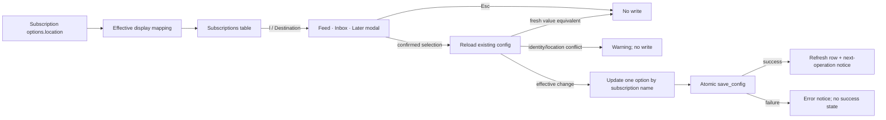

# refactor: Manage feed destinations in the TUI

## Overview

Make each subscription's effective Readwise destination visible and editable from the Subscriptions TUI. The TUI will offer the three user-facing choices **Feed**, **Inbox**, and **Later**, while preserving the existing backend, config, and CLI compatibility surface.

The routing backend already supports per-subscription `options.location`: unset values default to Feed, `inbox` aliases to Readwise's API value `new`, and sync/backfill pass the resolved value to the Readwise sink. This refactor adds a safe config-mutation seam and a focused TUI management flow rather than replacing that working pipeline.

---

## Problem Frame

Users can currently route a subscription by hand-editing `config.toml` or by passing `pulpwise add --location`, but the TUI neither shows nor edits that setting. This makes an important per-feed behavior invisible from the application's primary management surface.

Destination changes must be explicit and local: Pulp Wise is push-only, so changing a feed's destination applies to future sync and backfill pushes and must not imply that existing Reader documents will be moved.

---

## Requirements Trace

**TUI behavior**

- **R1. Destination visibility:** The Subscriptions table shows every subscription's effective Readwise destination.
- **R2. Three-choice TUI:** A user can choose Feed, Inbox, or Later from a modal opened for the highlighted subscription.

**Persistence and compatibility**

- **R3. Config persistence:** A confirmed change updates only that subscription's `options.location`, preserving its other options, disabled state, identity, and neighboring subscriptions.
- **R4. Routing correctness:** When a selection changes the fresh effective destination, Feed persists as `feed`, Inbox as canonical API value `new`, and Later as `later`; equivalent unset/alias states continue routing correctly without forced normalization.
- **R5. Compatibility:** Existing backend/config/CLI support remains intact, including manually authored `inbox`, canonical `new`, and legacy `archive` values.

**Safety and effect semantics**

- **R6. Safe management:** Cancelled, no-op, stale, invalid, and failed-load/save flows do not silently rewrite configuration or report false success.
- **R7. Effect clarity:** The TUI and documentation make clear that a saved change applies to sync/backfill operations started afterward; an operation already running keeps its startup destination.

---

## Scope Boundaries

- Do not narrow `SAVE_LOCATIONS`, change `pulpwise add --location`, or alter CLI help/output.
- Do not change pipeline routing, Readwise sink payload behavior, or the Feed default.
- Do not add destination data to SQLite or migrate the ledger.
- Do not move or mutate documents already saved in Readwise.
- Do not build a general-purpose TUI config editor or add a new TUI tab.
- Do not automatically rewrite legacy `archive`, alias `inbox`, or invalid manually authored values merely because the TUI rendered them.

---

## Context & Research

### Relevant Code and Patterns

- `src/pulpwise/config.py`: frozen `Config`/`Subscription` values, name-based immutable mutation helpers, and atomic `save_config()` persistence.
- `src/pulpwise/pipeline.py`: `DEFAULT_LOCATION = "feed"` and `_push_options()` provide the existing effective-value and validation behavior shared by sync and backfill.
- `src/pulpwise/sinks/readwise.py`: API-compatible `SAVE_LOCATIONS` and `canonical_location()` map user-facing Inbox to API value `new`.
- `src/pulpwise/tui/views/subscriptions.py`: the existing DataTable, cursor-preserving refresh, `BackfillPromptScreen` modal callback pattern, and non-markup notifications provide the local TUI conventions.
- `tests/test_config.py`, `tests/test_subscriptions_view.py`, and `tests/test_tui_smoke.py`: existing config, row-rendering, and TUI smoke coverage to extend.
- Recent enable/disable work provides the closest mutation and table-refresh pattern to follow.

### Institutional Learnings

- No `docs/solutions/` directory or applicable institutional learning document exists in this repository.

### External References

- No new external research is required: the Readwise API mapping is already implemented and covered by the existing sink and pipeline tests.

---

## Key Technical Decisions

- **Keep TUI choices separate from API-compatible locations:** The modal offers only Feed, Inbox, and Later; the existing sink/pipeline set remains broader so `archive` configs and scripts do not break.
- **Persist canonical API values on effective changes:** Inbox is a UI label; changing a fresh effective destination to Inbox writes `new`, matching the current CLI and sink boundary. Equivalent no-op states such as manually authored `inbox` remain unchanged and continue displaying/routing as Inbox.
- **Resolve defaults for display without forcing writes:** Unset and explicit `feed` both display as Feed. After reloading current config, confirming an already-effective choice is a no-op; changing from another value to Feed writes explicit `feed`.
- **Use a constrained immutable option mutation seam:** Add a name-based config helper that updates one non-empty option key with an exact `str` or `int` value, while keeping core config agnostic about source- and sink-specific semantics. It has no removal behavior and receives a fixed `location` key from the TUI rather than arbitrary user input.
- **Preserve legacy and invalid values until explicit repair:** `archive` displays as `Archive (legacy)` and unknown values display with an escaped `repr` such as `Invalid: ''`. Neither is preselected or coerced in the three-choice modal; choosing one of the supported destinations explicitly replaces it.
- **Reload and conflict-check before mutation:** The modal captures the selected subscription's `(name, source, url)` identity and raw location, then reloads the existing config on confirmation. It rejects a missing subscription or changed identity; a fresh value already equivalent to the selection becomes a no-op; and a conflicting raw-location change warns instead of being overwritten. Fresh edits to other options, disabled state, and neighboring subscriptions are preserved. Exact delete/recreate detection for an identical tuple and whole-file interprocess locking remain outside this bounded refactor.
- **Destination edits remain available for disabled subscriptions:** A paused feed can be prepared before it is re-enabled; the existing dimmed-row treatment continues to apply to the new column.

---

## Open Questions

### Resolved During Planning

- **Does the three-choice restriction apply to backend/config/CLI validation?** No. The user selected TUI-only narrowing; existing compatibility remains.
- **How should editing be exposed?** Add a Destination table column and an `l`/Destination modal chooser.
- **What happens to existing Reader documents?** Nothing; the saved choice applies only to sync/backfill operations started afterward.

### Deferred to Implementation

- **Exact Textual selection widget:** Use the simplest Textual 8-compatible modal control that supports keyboard selection, confirmation, and cancellation while matching the existing view style.
- **Exact column sizing:** Adjust widths only as needed after rendering the existing table with the added Destination column; avoid unrelated layout redesign.

---

## High-Level Technical Design

> *This illustrates the intended approach and is directional guidance for review, not implementation specification. The implementing agent should treat it as context, not code to reproduce.*

Display mapping:

| Config value | TUI display | Selectable as a new choice |
|---|---|---|
| unset / `feed` | Feed | Yes |
| `new` / `inbox` | Inbox | Yes |
| `later` | Later | Yes |
| `archive` | Archive (legacy) | No; may be explicitly replaced |
| unknown string/int | Invalid: value | No; may be explicitly repaired |

---

## Implementation Units

- [x] U1. **Add safe subscription-option mutation**

**Goal:** Provide a small immutable config operation that lets the TUI update one subscription option without duplicating config reconstruction or discarding unrelated state.

**Requirements:** R3, R6

**Dependencies:** None

**Files:**
- Modify: `src/pulpwise/config.py`
- Test: `tests/test_config.py`

**Approach:**
- Add a name-based helper for setting one subscription option, constrained to a non-empty key and exact `str` or `int` values (excluding booleans); define no removal behavior.
- Copy the selected subscription's options before applying the update; preserve all other `Subscription` fields, other subscriptions, auth configuration, and ordering.
- Keep the helper semantic-agnostic rather than teaching core config about Readwise destination values; unknown subscription names continue to raise `ConfigError` as existing mutation helpers do.
- Add a non-creating load mode for mutation flows so a config deleted between modal open and confirmation reports a missing file instead of silently creating a blank default config. Preserve first-run creation as the default behavior for existing callers.
- Do not change load-time option validation or serialization format otherwise.

**Execution note:** Implement the mutation contract test-first because silent option loss is the principal data-integrity risk.

**Patterns to follow:**
- `set_subscription_disabled()` in `src/pulpwise/config.py`
- Config round-trip and mutation-helper tests in `tests/test_config.py`

**Test scenarios:**
- **Happy path:** Setting `location` on one named subscription returns a new config with the requested value and leaves the original config unchanged.
- **Preservation:** Updating `location` retains tags, RSS/email-specific options, URL, source, disabled state, auth data, subscription order, and all other subscriptions.
- **Replacement:** Updating an existing `location` replaces only that key rather than merging stale subscription data.
- **Validation:** Empty option keys and boolean/unsupported option values are rejected rather than widening the existing option contract accidentally.
- **Error path:** Updating a missing subscription raises `ConfigError` and produces no partially updated config.
- **Missing file:** Non-creating reload reports a missing config without creating a replacement file; ordinary first-run `load_config()` still creates the default template.
- **Round trip:** Feed, canonical Inbox (`new`), and Later values written through the helper survive `save_config()` and `load_config()` unchanged.

**Verification:**
- The helper's behavior is fully covered without introducing Readwise-specific validation into the generic config loader.

---

- [x] U2. **Expose destination management in Subscriptions**

**Goal:** Show and safely edit the effective destination for each subscription from the existing TUI view.

**Requirements:** R1, R2, R3, R4, R5, R6, R7

**Dependencies:** U1

**Files:**
- Modify: `src/pulpwise/tui/views/subscriptions.py`
- Test: `tests/test_subscriptions_view.py`
- Create: `tests/test_subscriptions_tui.py`

**Approach:**
- Add a Destination column to the Subscriptions DataTable, positioned with the subscription identity columns rather than the sync-health columns.
- Add pure display/effective-value helpers for Feed, Inbox, Later, legacy Archive, and invalid values. Escape any user-authored value before rendering it as Rich/Textual markup.
- Extend disabled-row dimming across the new cell and update row tuple/index expectations accordingly.
- Add an `l` binding labeled Destination that opens a `ModalScreen` for the highlighted row. Offer exactly Feed, Inbox, and Later, with the current supported effective value selected.
- For `archive` or invalid current values (including an empty string), show the escaped `repr` of the current value but require an explicit supported selection; opening or confirming without a selection must not coerce to Feed.
- Make Enter/explicit confirmation return the canonical API value only when a supported option is selected, and Escape return cancellation. State that the choice applies to sync/backfill operations started after the save and not to a job already running.
- Capture `(name, source, url)` and the raw location when opening. In the callback, reload without creating and find the subscription again: reject an identity change; no-op if the fresh effective value already equals the selection; warn if the raw location changed incompatibly; otherwise update by name through U1 and save atomically.
- Handle missing files, malformed TOML, schema `ConfigError`, and read/write `OSError` as visible failures with no success message.
- Treat persistence and refresh as separate phases: after a committed save, refresh while retaining the highlighted row; if refresh fails, report `saved, but display refresh failed` rather than claiming the save failed.
- Permit editing disabled subscriptions; keep delete, backfill, and enable/disable behavior unchanged.

**Patterns to follow:**
- `BackfillPromptScreen` and `app.push_screen(..., callback)` in `src/pulpwise/tui/views/subscriptions.py`
- `_sub_row_cells()` and cursor preservation in `SubscriptionsView.refresh_data()`
- Markup escaping and `markup=False` notification conventions in the same view
- App composition and environment-isolation patterns in `tests/test_tui_smoke.py`; the new interaction file supplies its own Textual harness

**Test scenarios:**
- **Display:** Unset and `feed` render as Feed; `new` and `inbox` render as Inbox; `later` renders as Later.
- **Compatibility:** `archive` renders as Archive (legacy) without becoming a selectable default; unknown strings (including `''`) and integers render with an escaped, nonblank representation without crashing.
- **Markup safety:** A hostile bracket-bearing manual value cannot inject markup or crash the table/modal.
- **Disabled state:** Disabled rows still render every cell, including Destination, dimmed and keep `disabled` in the Status column after the column insertion.
- **Happy path integration:** Highlighting a subscription, opening Destination, choosing Inbox, and confirming persists `options.location = "new"`, refreshes the displayed cell to Inbox, and retains unrelated options.
- **Other choices:** Feed persists as `feed` when replacing another value; Later persists as `later`.
- **Cancel:** Escape closes the chooser without writing the config or showing success.
- **No-op:** After a fresh reload, confirming the current effective destination—including unset-as-Feed and alias `inbox`-as-Inbox—does not call `save_config()`.
- **Legacy repair:** Opening and cancelling an Archive or invalid value preserves it; pressing Enter/Confirm without first selecting a supported choice also performs no write; explicitly choosing one of the three supported destinations replaces it.
- **Selection boundary:** Pressing the Destination binding with no valid highlighted row performs no action.
- **Fresh-edit preservation:** While the modal is open, change unrelated fields on the selected subscription and a neighboring subscription; confirmation preserves those edits and changes only location.
- **Fresh-state no-op:** If an external edit already changed the raw location to the selected effective value, confirmation preserves it as a no-op; if it changed to a different effective destination, confirmation warns instead of overwriting it.
- **Stale identity:** Removing the selected subscription, or recreating it under the same name with changed source/URL identity, produces a warning and does not mutate the replacement.
- **Load failures:** A deleted config is not recreated; malformed TOML and schema-invalid TOML report errors without writes or success notices.
- **Persistence failure:** A write failure reports an error, emits no success notice, and does not update the table to claim a saved destination.
- **Post-commit refresh failure:** A successful save followed by a refresh failure reports that persistence succeeded but display refresh failed.
- **Effect boundary:** Destination editing does not call sync/backfill and does not mutate ledger state.

**Verification:**
- Automated Textual interaction proves the modal-to-config path, while pure helper tests cover all display and compatibility mappings.
- Keep pytest synchronous: wrap the Textual 8.2.5 `App.run_test()` async scenario with the standard library, enable notifications, activate the Subscriptions tab, and focus its DataTable before driving the binding. Do not add `pytest-asyncio` unless implementation proves the standard-library harness insufficient.
- Manual rendering confirms the new column and modal remain usable at the application's normal terminal size.

---

- [x] U3. **Document destination management behavior**

**Goal:** Tell users where to find destination management and set accurate expectations about compatibility and effect timing.

**Requirements:** R5, R7

**Dependencies:** U2

**Files:**
- Modify: `README.md`
- Modify: `SPEC.md`

**Approach:**
- Update the README's Subscriptions TUI description and keybinding list to include the Destination column and Destination chooser.
- Explain that Feed, Inbox, and Later are the TUI choices, with Inbox mapping to Readwise's `new` location.
- State that destination changes apply to sync/backfill operations started after the save, do not alter a job already running, and do not move documents already in Reader.
- Preserve existing config and CLI documentation for `archive` and other compatible backend values; do not imply a breaking validation change.
- Record the TUI management behavior in the current-state/locked-decision portion of the spec where future refactors will find it.

**Patterns to follow:**
- Existing concise TUI tab bullets and keyboard summary in `README.md`
- Locked routing and push-only decisions in `SPEC.md`

**Test scenarios:**
- **Test expectation: none —** documentation-only unit; verify terminology and behavior against U2 and the existing routing contract.

**Verification:**
- README and spec consistently distinguish user-facing Inbox from API/config `new`, and neither promises relocation of existing documents.

---

## System-Wide Impact

- **Interaction graph:** TUI selection → fresh config load → immutable option update → atomic TOML save → table refresh. Pipeline and sink remain downstream consumers on later operations.
- **Error propagation:** Config lookup/load/write failures terminate the edit flow with a visible notification; they must not crash the TUI or produce a success state.
- **State lifecycle risks:** No SQLite changes occur. An in-flight sync/backfill retains its starting subscription snapshot; the edit applies only to operations started after persistence succeeds.
- **API surface parity:** Existing config, CLI, sync, and backfill behavior remains available. Only the TUI's new-choice surface is intentionally limited to three destinations.
- **Integration coverage:** A Textual interaction test should prove the cross-layer modal → config persistence path; pure row tests alone are insufficient.
- **Unchanged invariants:** Feed remains the default, `archive` remains backend-compatible, Reader documents are never moved/deleted, and unrelated subscription options survive every edit.

---

## Risks & Dependencies

| Risk | Mitigation |
|---|---|
| A modal opened on `archive` or invalid input silently reroutes to Feed | Do not preselect/coerce unsupported current values; require an explicit supported choice. |
| Editing from a stale TUI row overwrites manual config changes | Reload without creating, compare captured identity/raw location, reject conflicts, and mutate only one option on the fresh config. |
| Generic config save rewrites the whole TOML and can lose comments | This is existing `save_config()` behavior; document no new preservation promise and keep writes explicit/no-op aware. |
| Table column insertion breaks row indexes or disabled styling | Centralize row construction and update focused tests for the full tuple. |
| Readwise silently falls back when a destination is disabled in account settings | Keep existing documentation caveat; a successful TUI save means local configuration was persisted, not remote placement was verified. |
| Textual widget details differ across installed versions | Use the project's locked Textual 8.2.5-compatible APIs and keep widget choice deferred to implementation. |

---

## Documentation / Operational Notes

- No migration or rollout step is required.
- Existing configs remain valid without edits.
- Destination changes take effect for sync/backfill operations started after the save; currently running work is not reconfigured mid-operation.
- Manual verification should use an isolated config path and must not touch the developer's real token or subscription file.

---

## Sources & References

- Related code: `src/pulpwise/config.py`
- Related code: `src/pulpwise/pipeline.py`
- Related code: `src/pulpwise/sinks/readwise.py`
- Related TUI: `src/pulpwise/tui/views/subscriptions.py`
- Related tests: `tests/test_config.py`
- Related tests: `tests/test_subscriptions_view.py`
- Product documentation: `README.md`
- Architecture specification: `SPEC.md`
